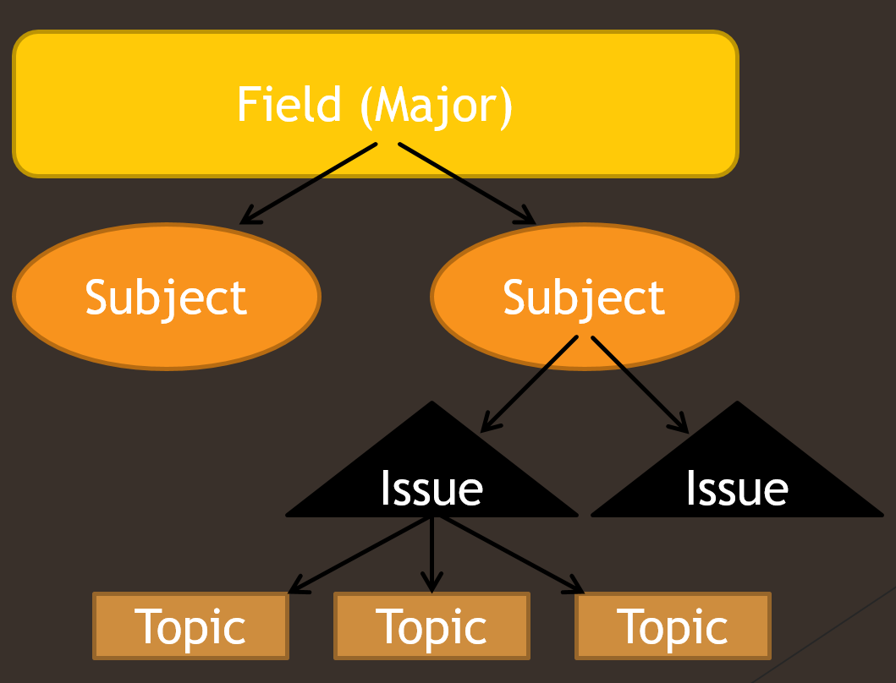

# Research Questions 
Writing an effective and significant research question can be challenging. You don’t want to go on a wild goose chase for a question that either already has an answer or has no possible answer. Always think about the significance of your question to your field. Why does it matter? Think about what impact answering your research question will have on knowledge in your field. Once you are satisfied with that thought experiment, you’ll probably have a good research question.

The first steps to start turning a topic into a question are to use the journalistic questions who, what, when, where, et cetera. Focus on “why”—that’s usually the best question to ask for a research project like this one.Why is this important? You need a research question to start conducting meaningful research. Without a question that needs an answer (and doesn't already have an answer), you will end up writing a report instead of proposing an original research study. Once you have a topic, you need to narrow it down even more to come up with a research question.

This module has a few PDFs. Make sure you come back to the module after each one until you get to the WRIT 250 common topics list, which is the last page.

## What makes a good research question? 
PDF Link: [What makes a good research question?](assets/research-questions.original.pdf)

## Narrowing Research Questions
Generally, a topic is too broad if you can state it in four or five words. For example, “Nutrition in juvenile prisons is too broad. Can you think of ways to use [action words](http://www.writeexpress.com/action-verbs.html) and more detailed nouns to narrow this broad topic into a suitable research question?

What are some other ways you can locate a topic? Other than using the content you already located for the exploratory essay, you can use Wikipedia portals: [Wikipedia portals](https://en.wikipedia.org/wiki/Portal:Contents/Portals) are a great way to explore subjects and locate issues. Find a portal related to your major and spend some time reading random articles: you might find something that interests you!

This week is focused on finding research questions within individual majors. What is the relationship among subjects, issues, and topics? Basically, if we consider “Field” to be the largest category (or “major), the next division within Field would be Subject. For the field of Criminal Justice, two subjects might be [“Corrections”](https://en.wikipedia.org/wiki/Corrections) and [“Homeland Security.](https://en.wikipedia.org/wiki/Homeland_security) These are broad categories that have whole journals, books, and even classes devoted to them. Subjects can be broken down into issues and topics. 

If we choose the subject of “Corrections,” two issues might be “prisoner [recidivism](https://en.wikipedia.org/wiki/Recidivism),” or ex-convicts returning to prison after committing more crimes, and “corrections officer retention.” Issues are still too broad, though. How can we reduce an issue to a topic? Well, if we choose “prisoner recidivism” as our issue, two topics might be 1, the role of inmate educational programs in rehabilitation of ex-cons and 2, support programs for ex-inmates in the community once they get out. 

Those still aren’t research questions, but they are much more precise, and can easily be transformed into research questions.

## Example Research Proposals
Here are some example research proposals from different fields: [Example Reseach Proposals](assets/proposals.pdf)

## Topic Ideas
Here are some topic ideas categorized according to discipline: [Topic Ideas Categorized According to Discipline](assets/topicideas.pdf)

