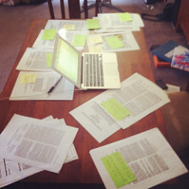
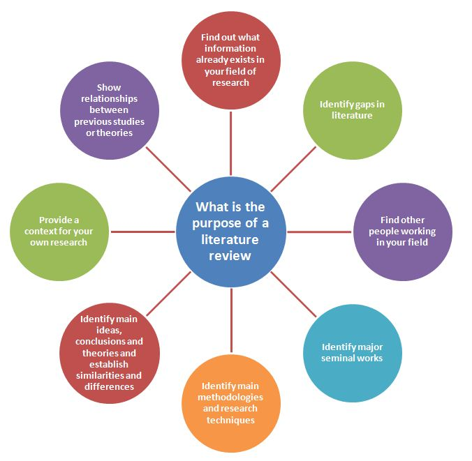
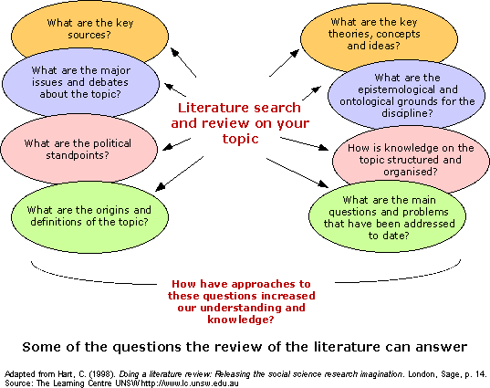

# Literature Review 
This module introduces you to assignment 3 and to literature reviews in general. Many students find the literature review the most challenging assignment in Writing 250, but it's really pretty similar to writing that you've probably done before. This module has several external links and PDFs to external resources to guide you through, and there are several example student essays available in Blackboard for you to use as models.

*Photo Source: https://www.flickr.com/photos/vroomvroommm/6874277657* 

## What is a Literature Review?
Essentially, a [literature review](https://en.wikipedia.org/wiki/Literature_review) establishes the state of research on a given topic in a given field. It is an account of everything important that has been published on a topic in the field. Usually literature reviews are a part of larger documents, but sometimes they stand alone. The implicit purpose of most literature reviews is to show a need or gap in existing scholarship that justifies a proposed research project. 

Your purpose is to convey to your reader what knowledge and ideas have been established on a topic. It is both a summary and a synthesis of secondary research. In general, literature reviews DO have a thesis, or guiding concept. An effective literature review is not just a series of annotations connected with transitions. The overall purpose is to show where sources intersect, where they agree, and where they disagree. The annotations you just completed for Assignment 2 should give you the raw material to assemble this review. Your job now is to put sources together and come up with a conceptual framework for representing the current state of academic research on your topic.

*Source: https://ltl.lincoln.ac.nz/research/writing-a-literature-review/what-is-a-literature-review/* 

Literature Reviews are usually a part of a larger research paper. In fact, you will be including a condensed version of your literature review in your Prospectus for assignment 4. It's important that you think of your literature review as a stand-alone paper at this stage, though.  Assignmet 3 should display the development of skills of information seeking and of critical appraisal. What I am looking for is, 1, that you located, organized, and evaluated quality academic sources for the annotated bibliography, and were able to keep track of them long enough to persist to this stage in the research process, and 2, that you are able to see how those academic sources are in conversation.

PDF Reading: [What is a literature review?](assets/litreviews.pdf)

## Guiding Questions
What are some basic rules for literature reviews? They must be organized around and related to your research question. This is an area where a lot of writers get tripped up. The literature review is not directly about your research topic. Instead, it should imply  your research topic. Point to your hypothesis without actually stating it. Like you had to do for the Exploratory Essay, remember that for the literature review you should be writing primarily about the sources and how they intersect. 

In the process of making this work, you must synthesize existing research into summaries of what is, and what is not, already known. Identify points of controversy and contention, and speculate about areas that need future research (those areas will, of course, correlate to the research project you are going to propose. Here are some questions to get you started:

1. What is the specific thesis, problem, or research question that your literature review helps to define?
2. How does that align with what you laid out in your informal research proposal?
3. What type of literature review will you conduct, and how will you organize it?
4. Is most of the research theoretical? Quantitative? Qualitative?
5. What is the scope of the review?
6. How good was your collection of sources?
7. Can you critically analyze your sources appropriately?
8. Have you located sources that are contrary to your own beliefs on the topic?
9. Will the reader find the review relevant, appropriate, and useful? 

## Where to begin? 
It can help to think about the literature review as a critical multi-book book report. You are making an argument in a literature review, but that argument is pretty much going to be “this is the current state of research on X, and this is where the gaps in the research are on X.”

The logical place to begin working on the literature review is the annotated bibliography that you just completed. The whole purpose of the annotated bibliography was to give you the "raw material" for the literature review. In the annotated bibliography, you had to summarize sources, evaluate them, and craft a reasoned introduction for the entire document. The literature review adds synthesis of the sources to that mix of purposes.

Begin by organizing your sources from the annotated bibliography. Develop a strategy for putting them together to represent relationships. Once you determine how the sources are in conversation with one another, you'll essentially have an outline for the literature review.

As you are trying to think about relationships between sources, and what some of the main points of conversation (and contention) are among your sources, there are some basic questions you can ask about each source. Use the following guidelines to take notes about your sources, above and beyond the annotations you’ve already written. Don’t think about your sources in isolation: think about how they relate to one another, and what the “big picture” looks like.

First, ask what the overall position of an article is. We’ve already established that a good research question, and thus a good topic, lends itself to positions and arguments. If you’ve done your reading in The Craft of Research, you know the qualities of a productive and viable topic. A good topic should lend itself to various positions. Think about what the “thesis statement” is for each article.

Next, think about the differences and similarities of the articles’ positions. Is there much consensus, or do several of your sources disagree? What is the disagreement about? Where is the overlap in terms of positions, and where is the contention?

For each source, ask yourself how the authors justify their research. How do they explain the significance of the work they are publishing? How do they establish credibility in the field? Does a source’s author identify a specific area of need in the existing scholarship into which they neatly fit? 

Then, think about how they are using evidence. What kind of evidence are they using in the first place? Quantitative? Qualitative? Some combination? What weaknesses do you perceive to be a part of the extant evidence? Also, think about where evidence overlaps. Do different sources refer to the same foundational study? Do they use similar methods? Do sources with similar positions also employ similar evidence?

Finally, and most importantly, when you look at all the sources as a whole, do you see any gaps in the research? What are some issues that aren’t covered in your sources that you think need to be addressed? You’ve already laid out your own research topic: think about how your idea “fits in” to the existing work. Ideally, you will identify a gap in scholarship into which your own research proposal fits neatly later one.

You can use a synthesis matrix to organize your responses to these questions, and to help generate some meaning out of your source inquiry. The next page will guide you through using the synthesis matrix journal assignment.

## Using the Synthesis matrix
Additional File: [Synthesis Matrix Handout](assets/synthesis-matrix.pdf)

A synthesis matrix is a tool to help visualize where sources fit together. Think of synthesis as the opposite of analysis. If you are analyzing something, like a book or a movie, you are essentially taking it apart to find meaning. In synthesis, you are putting things together to find meaning. In this case, you are putting together academic sources to make meaning. The synthesis matrix puts sources in the horizontal axis and main ideas on the vertical axis. Be sure you clearly identify each source in the horizontal axis so you don’t accidentally lose track of something.

Watch the tutorial below to see how the synthesis matrix works. The handout I use to demonstrate the matrix is attached as a PDF to this page.

YouTube Video: [Synthesis Matrix Tutorial](https://www.youtube.com/watch?v=_13GGEhi99g)

## Structuring your Literature Review
*Some content adapted from Victoria Bryan, Karla Lyles, and the WRIT 250 Curriculum Development Committee* 

A literature review often uses certain phrases or language in body paragraphs to introduce sources and show the commonalities and differences between/among them.

For example:

Body paragraph 1. “Most scholars argue that…” [you would go on to describe, in the paragraph, sing quotes, paraphrases,and summaries and citing sources accordingly, what position the majority of scholars take, more or less, on your issue (the things they agree on)]

Body paragraph 2. “Others believe that…” [you would go on to describe, in the paragraph, using quotes, paraphrases, and summaries and citing sources accordingly, the second most-commonly-held view on the topic]

Body paragraph 3. “A few believe…” or “One scholar believes…” [you would go on to describe, in the paragraph, using quotes, paraphrases, and summaries and citing sources accordingly, what you might call the rogue view (such scholars are called outliers) on the topic]

## Module Summary
The literature review is tough, but it isn't beyond your abilities. This assignment is the peak of the course. If you can get through this, you'll find the rest of the semester much easier. Review this module carefully, take a look at the example literature reviews, and get started early. This assignment really can't be thrown together at this last minute: it requires a lot of critical thinking and, most importantly, critical reading of your sources. Be sure to reach out to your instructor or your classmates if you need help.