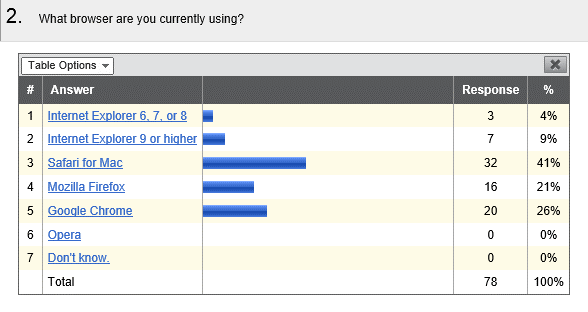
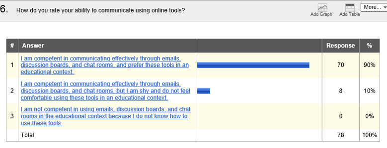
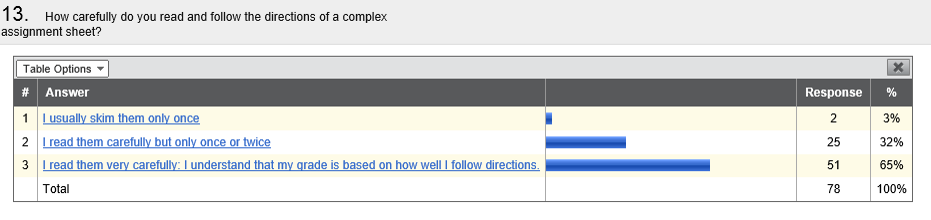
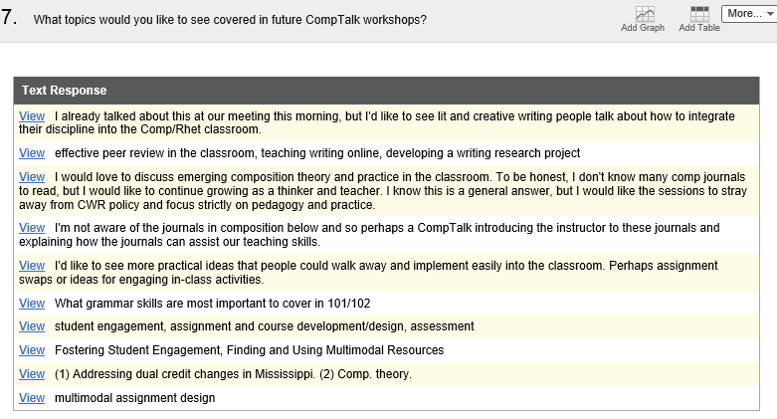

# Analyzing Research Data
This module is designed to introduce you to the process of data analysis give you practice interpreting primary research data. We’ll be working with the results from the in-class mini-survey since you did not actually conduct live primary research for this class. Keep in mind that the results you get out of this exercise might not be meaningful; that’s not the point: The point of the primary research exercise is to demonstrate the process so that you can effectively design an original research process in your prospectus. The goals of this module are to analyze and interpret data from the mini-survey, learn about the difference between quantitative and qualitative data, report survey results in a meaningful way, and reflect on the effectiveness of the mini survey (and apply that reflection to the design section of the prospectus).

## Interpretation of Data 
First, let’s start with some of the particulars of the mini-survey. The assignment required you to design and deploy a survey with three different question types. I left it up to you what types of questions you wanted to use, and only required that you have at least one qualitative and one quantitative question. Why did the assignment have these requirements? In research methodology, this concept is called the triangulation of data. The idea is that if you collect data from a variety of sources using a variety of methods, that data will be more reliable, relevant, and durable. The same concept applies to secondary research: you don’t want to take all of your secondary sources from the same journal or book. Consensus is a critical part of building a case for a research result.

So, how does quantitative data work? Why is it useful? Ultimately, quantitative data is data that can be analyzed numerically. Raw numbers can be used to determine trends, and are more objective than other kinds of data. That doesn’t mean that quantitative questions exemplify absolute truth; however, they exist on the more objective side of the continuum. The next slides will look at some survey questions I have used over the last year or so.

One of the questions I asked in my survey was “What browser are you using?” Why is this a quantitative question? Well, it is multiple choice: the results can be broken down into usage percentages and raw numbers. It is an objective fact that 7 people responded to this question that they were, at that moment, using Internet Explorer. Now, does that mean with 100% certainty that those 7 people were in fact using Internet Explorer? No. There is always room for error in a quantitative question. However, on the spectrum of objectivity, we can put a fair amount of trust in this response. What factors do you think could limit the accuracy of these responses? Well, for one thing, novice computer users may not know what a browser is, or how to respond in an honest way to this question. In fact, they may not know that they don’t know the answer. This depends entirely on your subject pool of course. But, more generally, what would be a better way to gather this data? Most survey software, like Qualtrics, can gather user metadata. In other words, the survey itself could capture what browser a participant is using. As long as your consent procedures make subjects aware that metadata may be used, you are in the clear in terms of compliance issues.

## Interpretation of Data

What about this question? I asked “how do you rate your ability to communicate using online tools?” This is still a quantitative question, because survey users have to select a response. But let’s look at the choices they have. Each option is very wordy, and contains lots of different tools. Even so, users have to choose from one of the three survey options. What if survey users are comfortable with emails and discussion forums, but not with chat rooms? What if they feel comfortable with these tools, but they aren’t competent? There are lots of factors that could distort the results from this quantitative question. What do you think a more effective method for gathering this information would be? Well, there are probably several methods that could work, but one might be splitting it off into several questions. For example, you could have users rate comfort level with individual tools on a Likert scale.

What about this question? If I am asking “how carefully do you read and follow directions of a complex assignment sheet,” what could be some problems with these response options? Well, it’s pretty obvious that the 3rd option is the one the surveyor wants you to choose. This is an example of a leading question, and it demonstrates how quantitative questions can be used to promote and agenda or point of view. Part of being an effective researchers is being honest, and being able to accept results even if they do not align with your personal beliefs on the subject.

## Writing Analysis of Data
Let’s return to the first survey question I showed you to talk about how to analyze your results and write about them. What kinds of conclusions can we draw from this question? Well, I can say that at least 41% of survey users are using a Mac computer, because they selected that they were using the Safari for Mac browser. Can I say that 59% are using PCs? No, not really, because Firefox and Chrome also have Mac versions, so some of those users might be using either platform. I can say, however, that at least 13% of my users are on PCs, because they selected internet explorer, which does not have a Mac version. If I wanted to push my analysis further, I could compare this survey to large-scale browser use surveys. For examples, visit http://gs.statcounter.com 

Looking at these results, I can make a few conclusions: Lots of users of this survey prefer Macs, and lots of them prefer Macs using the default browser (Safari). I can also note that proportionally fewer users prefer internet explorer in this sample group. I could go on with my analysis of this question, but you get the point.

## Qualitative Data 
Let’s move on to talk about qualitative data. Qualitative data cannot be analyzed numerically in the same way that quantitative data can. However, that doesn’t mean that it is less useful. In a lot of cases, the opposite is true. When you analyze qualitative data, you are looking for patterns and trends. This kind of analysis can be more difficult, but also more rewarding to researchers. Usually, analysis of qualitative data involves coding, or developing a system to categorize qualitative responses.

Let’s look at this question. I asked “What topics would you like to see covered in future CompTalk workshops?” For your reference, CompTalk Workshops are monthly professional development workshops for Writing and Rhetoric teachers here at Ole Miss. If you were to code these responses, what words might you look for? Well, you might see how often the word “classroom” occurs, and compare that to how many times the word “student” or “teacher” occurs. Since these are open responses, some of them make several different suggestions. You could come up with a master list of suggestions and see how many times each one is mentioned. Can you think of any other ways you might work with this survey data?

## Module Summary
You won't be conducting a large scale research project for this class, but you will be designing to methods for one. You are also in the process of designing and collecting data from your mini-survey. Hopefully, this introduction to quantitative and qualitative analysis will help you work with the data you're collecting and anticipate the kind of results you might get if you were to conduct your research project in the real world.